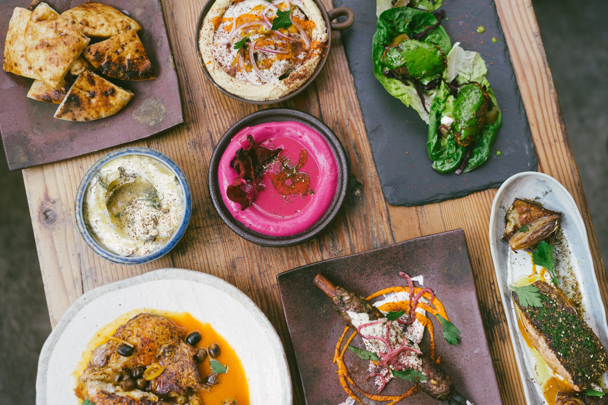
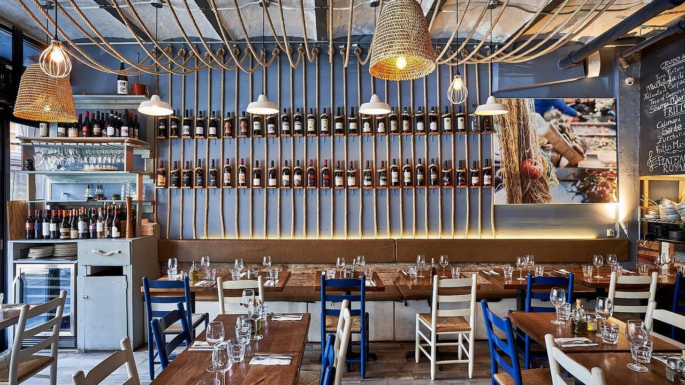
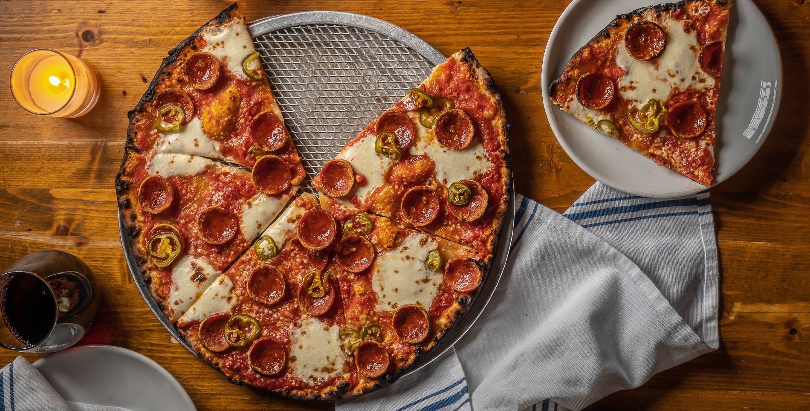
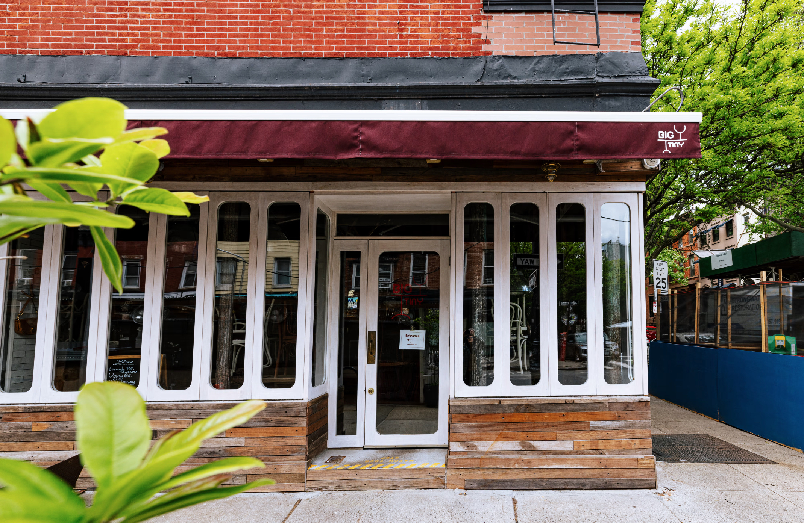
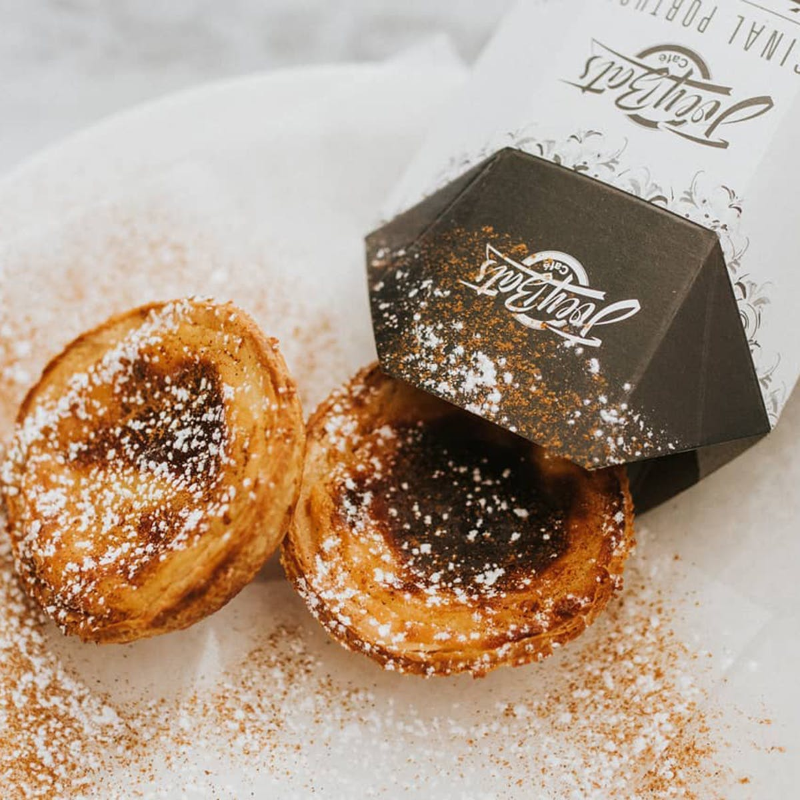

New York has a nearly overwhelming number of restaurants. Here are 5 of my favorites.

## Miss Ada
### Mediterranean | $$$ | *Fort Greene, Brooklyn*

[Google Reviews](https://maps.app.goo.gl/LRdopowUYCTtHEjA8): 4.7 stars

## Piccola Cucina Estiatorio
### Italian | $$ | *SoHo, Manhattan*

[Google Reviews](https://maps.app.goo.gl/K7Ym2tfykTrPXkww6): 4.6 stars

## Emily
### Pizza | $$$ | *Clinton Hill, Brooklyn*

[Google Reviews](https://maps.app.goo.gl/NeoDhPm9bPAgPW6h6): 4.5 stars

## Big Tiny
### French | $$ | *Cobble Hill, Brooklyn*

[Google Reviews](https://maps.app.goo.gl/K8KWoMKVrc1GvreM7): 4.8 stars

## Joey Bats Cafe 
### Portuguese Bakery | $ | *Lower East Side, Manhattan*

[Google Reviews](https://maps.app.goo.gl/wKtGeKy429YjJE8S9): 4.8 stars

